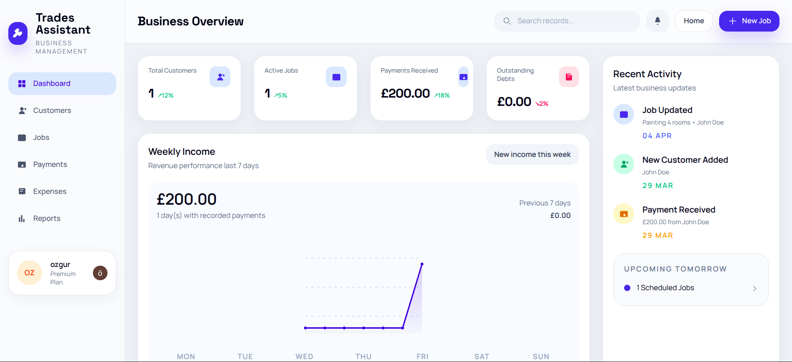

# Trades Assistant

Trades Assistant is an AI assistant for small trades businesses. It combines a web dashboard with a WhatsApp-first AI workflow so a solo tradesperson can manage customers, jobs, payments, expenses, and day-to-day admin by chatting in natural language.

<p align="center">
  
</p>

<p align="center">
  <a href="./docs/assets/tradesapp-demo.mp4">Watch the short demo video</a>
</p>

## Why This Project Exists

Most small trades businesses do not want a heavy CRM.
They need something faster:

- save a customer quickly
- create or update a job in seconds
- record a payment while on the move
- keep track of outstanding balances
- see a simple business overview without spreadsheets

Trades Assistant is built around that workflow. The idea is simple: let a tradesperson run the admin side of the business through an AI assistant on WhatsApp, while still having a clean web dashboard for visibility and manual control.

## What Problem It Solves

Small business admin is often fragmented across:

- WhatsApp chats
- paper notes
- memory
- bank statements
- spreadsheets

That creates missed follow-ups, unclear balances, duplicated work, and poor visibility into what is still unpaid.

Trades Assistant acts as an AI admin layer on top of those day-to-day operations and centralizes them into one system:

- customer records
- jobs and job status
- payments
- expenses and vendor debt
- summaries and exports
- WhatsApp-based business actions

## Core Features

- AI assistant workflows over WhatsApp for creating jobs, updating job status, recording payments, logging expenses, and asking for summaries
- Web dashboard for customers, jobs, payments, expenses, and high-level business metrics
- Natural-language intent handling for conversational commands
- Customer and job resolution logic for ambiguous user input
- Daily, weekly, and monthly business summaries
- Export support for records, vendor reports, and expenses
- Phone verification and WhatsApp onboarding flow
- Optional billing/authentication integrations for a production-style SaaS setup

## Product Flow

1. A business owner signs in on the web app and connects their account.
2. They verify their phone number and activate WhatsApp access.
3. They can then send messages like:
   - `create a job for John Doe called boiler repair`
   - `record payment 200 from John`
   - `complete all jobs`
   - `show today's jobs`
4. The AI assistant backend interprets the request, resolves entities, executes the workflow, and stores the result.
5. The dashboard reflects the latest state of the business in a more visual format.

## Tech Stack

### Frontend

- React 18
- TypeScript
- Vite
- Tailwind CSS
- React Router
- Clerk for authentication

### Backend

- Node.js
- Express
- TypeScript
- Prisma ORM
- PostgreSQL

### Integrations

- Twilio for WhatsApp and SMS flows
- Clerk for auth
- Stripe for billing/webhooks
- OpenAI-compatible LLM integration for semantic interpretation, intent resolution, and assistant behavior

## Architecture Overview

The repository is split into two applications:

- `frontend/`  
  React + Vite dashboard and onboarding UI
- `backend/`  
  Express API, Prisma models, messaging workflows, and assistant runtime

Backend responsibilities include:

- authenticated account APIs
- dashboard data endpoints
- WhatsApp webhook handling
- AI-assisted natural-language understanding
- natural-language intent parsing
- workflow execution for customer/job/payment/expense actions
- reporting, exports, reminders, and operational services

The backend contains a newer `conversation-v2` flow that separates:

- intent resolution
- slot filling
- entity resolution
- confirmation handling
- workflow execution

That structure makes the assistant easier to test, extend, and harden for real conversational use.

## AI Assistant Focus

This project is not just a CRUD dashboard with chat on the side.
The core product idea is an AI assistant that can understand messy, real-world WhatsApp messages from a tradesperson and turn them into structured business actions.

Examples:

- `create a job for John tomorrow`
- `mark that one completed`
- `record 200 cash from Sarah`
- `show me this week's payments`

The assistant is designed to bridge the gap between casual conversation and reliable backend operations.

## Screenshot And Demo

### Dashboard


### Demo Video

- [Open the demo video](./docs/assets/tradesapp-demo.mp4)

## Getting Started

### Requirements

- Node.js 20+
- npm 10+
- PostgreSQL 15+

### 1. Clone the repo

```bash
git clone <your-repo-url>
cd tradesApp
```

### 2. Install dependencies

```bash
cd backend
npm install
```

```bash
cd ../frontend
npm install
```

### 3. Configure environment variables

Backend:

```bash
cp backend/.env.example backend/.env
```

Frontend:

```bash
cp frontend/.env.example frontend/.env
```

Important backend variables:

- `DATABASE_URL`
- `BASE_URL`
- `PORT`
- `TWILIO_ACCOUNT_SID`
- `TWILIO_AUTH_TOKEN`
- `TWILIO_SMS_FROM`
- `TWILIO_WHATSAPP_FROM`
- `TWILIO_SANDBOX_JOIN_CODE`
- `CLERK_PUBLISHABLE_KEY`
- `CLERK_SECRET_KEY`
- `LLM_PROVIDER`
- `LLM_API_KEY`
- `LLM_MODEL`
- `STRIPE_SECRET_KEY`
- `STRIPE_WEBHOOK_SECRET`

Important frontend variables:

- `VITE_API_BASE_URL`
- `VITE_CLERK_PUBLISHABLE_KEY`

### 4. Prepare the database

```bash
cd backend
npm run prisma:generate
npm run prisma:migrate -- --name init
```

### 5. Run the apps

Backend:

```bash
cd backend
npm run dev
```

Frontend:

```bash
cd frontend
npm run dev
```

Default local URLs:

- frontend: `http://localhost:5173`
- backend: `http://localhost:3000`

## Available Scripts

### Backend

- `npm run dev`
- `npm run build`
- `npm run start`
- `npm run test`
- `npm run prisma:generate`
- `npm run prisma:migrate -- --name init`

### Frontend

- `npm run dev`
- `npm run build`
- `npm run preview`

## Project Structure

```text
tradesApp/
├── backend/
│   ├── prisma/
│   ├── src/
│   │   ├── conversation-v2/
│   │   ├── messaging/
│   │   ├── routes/
│   │   └── services/
│   └── tests/
├── frontend/
│   └── src/
│       ├── components/
│       ├── lib/
│       └── pages/
└── docs/
    └── assets/
```

## Notes

- Local `.env` files are not meant to be committed.
- Twilio, Clerk, Stripe, and LLM integrations are optional for basic local development, but some flows depend on them.
- The project is designed around UK-based trades workflows and WhatsApp-style natural language.

## Future Direction

This project is moving toward a more capable assistant runtime that can:

- handle more complex multi-step conversations
- reduce ambiguity in job and customer references
- support richer summaries and proactive reminders
- make WhatsApp a practical operating surface for a small business

## License

No license has been added yet. If you plan to make the repository public, add a license file before publishing.
